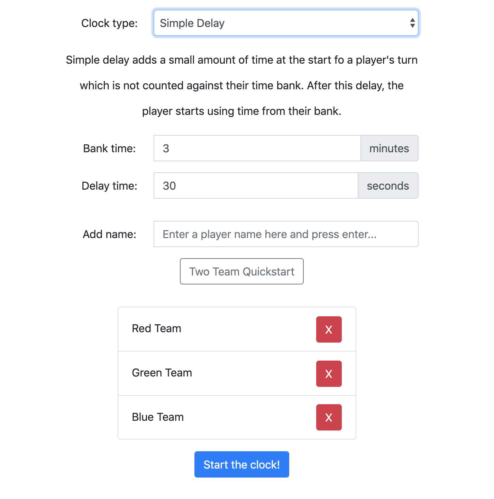
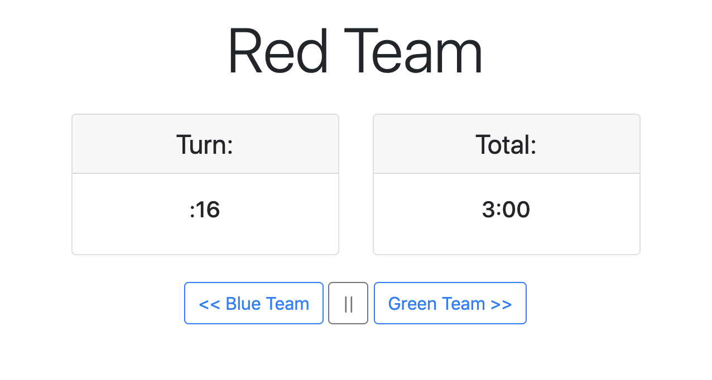

# Game Timers

This project is used to setup a timer for board game session for any number of players, and then use the timer while 
playing to keep the pace of the game more regulated. There are 6 types of timers to choose from, each of which provides
a brief description of what they do ([more information](https://en.wikipedia.org/wiki/Time_control)). Once the clock is
setup, there is a simple interface which lets you control the clock by going to the next or previous player, and pausing
the clock (for rules clarifications). 

## Install
To install, create a virtual environment to contain this project (see 
[using virtual environments](https://packaging.python.org/guides/installing-using-pip-and-virtual-environments/)), 
install the necessary requirements.
```bash
python3 -m venv game-timer
pip install -r requirements.txt
```

## Usage
1. Run the flask server with `python3 app.py`
2. Navigate to the main page (setting up your clock): [localhost:8080](http://localhost:8080/)
3. Setup your clock by choosing your settings. Add the names of the players playing in the game. Select `Start the clock!`
4. The clock should now be started. You can go to the next player (right arrow), previous player (left arrow), or pause the game (space bar)

## Examples

Here are some examples of this application

### Setup

### Clock Interface


## Contributing

PRs accepted.

## License

MIT © Sam Procter